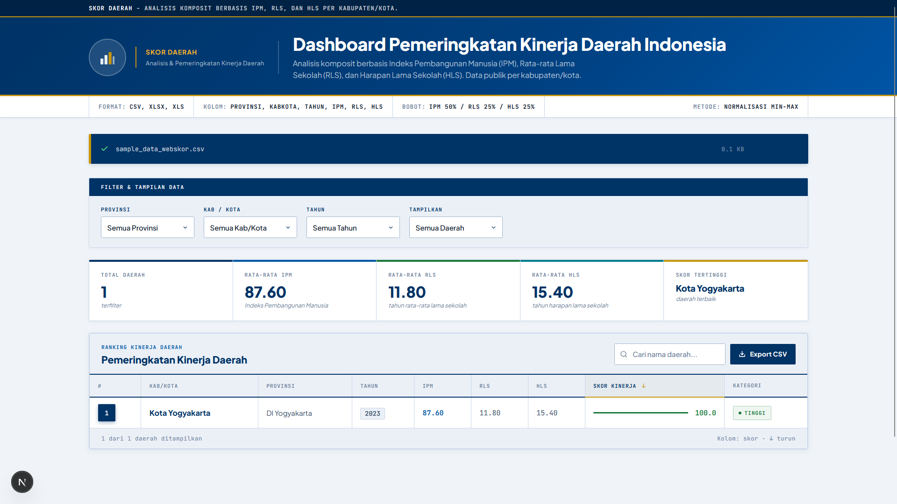
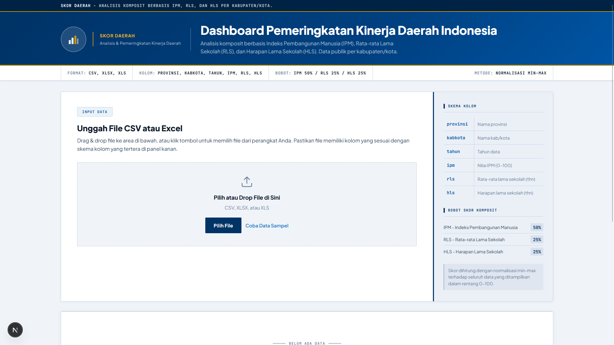

# Skor Daerah

Dashboard pemeringkatan kinerja daerah di Indonesia berbasis **Indeks Pembangunan Manusia (IPM)**, **Rata-rata Lama Sekolah (RLS)**, dan **Harapan Lama Sekolah (HLS)** per kabupaten/kota. Unggah data CSV atau Excel, lalu skor komposit dihitung otomatis di browser.



## Fitur

- **Upload data**: file CSV, XLSX, atau XLS lewat drag & drop atau tombol pilih file
- **Data sampel**: tombol _Coba Data Sampel_ untuk mencoba tanpa menyiapkan file sendiri
- **Skor komposit otomatis** dengan normalisasi min-max (bobot IPM 50%, RLS 25%, HLS 25%)
- **Filter data** berdasarkan provinsi, kabupaten/kota, dan tahun, serta opsi jumlah daerah yang ditampilkan
- **Ringkasan statistik**: total daerah, rata-rata IPM, RLS, dan HLS, serta daerah dengan skor tertinggi
- **Tabel pemeringkatan** yang bisa diurutkan per kolom, dilengkapi bar skor dan label kategori kinerja
- **Pencarian** nama daerah langsung di tabel
- **Export CSV** hasil pemeringkatan

## Tampilan

### Input Data

Unggah file sendiri atau pakai data sampel. Skema kolom dan bobot skor ditampilkan di panel kanan.



### Hasil Pemeringkatan

Setelah data dimuat, dashboard menampilkan filter, ringkasan statistik, dan tabel ranking kinerja daerah.


## Format Data

File harus memiliki kolom berikut (nama kolom huruf kecil):

| Kolom      | Keterangan                     |
| ---------- | ------------------------------ |
| `provinsi` | Nama provinsi                  |
| `kabkota`  | Nama kabupaten/kota            |
| `tahun`    | Tahun data                     |
| `ipm`      | Nilai IPM (0–100)              |
| `rls`      | Rata-rata lama sekolah (tahun) |
| `hls`      | Harapan lama sekolah (tahun)   |

Contoh isi CSV:

```csv
provinsi,kabkota,tahun,ipm,rls,hls
Provinsi A,Kabupaten X,2024,72.5,8.9,13.1
Provinsi A,Kota Y,2024,80.2,10.8,14.6
```

File contoh lengkap tersedia di [`sample_data_webskor.csv`](sample_data_webskor.csv).

## Metode Perhitungan

Skor dihitung dengan **normalisasi min-max** terhadap seluruh data yang ditampilkan, sehingga hasilnya berada dalam rentang 0–100.

1. Setiap indikator dinormalisasi:

   ```
   nilai_normal = (nilai - min) / (max - min) × 100
   ```

2. Skor komposit dihitung dengan bobot:

   | Indikator | Bobot |
   | --------- | ----- |
   | IPM       | 50%   |
   | RLS       | 25%   |
   | HLS       | 25%   |

   ```
   skor = 0.50 × IPM_normal + 0.25 × RLS_normal + 0.25 × HLS_normal
   ```

Karena min dan max dihitung dari data yang sedang dimuat, skor bersifat **relatif** terhadap data tersebut. Skor suatu daerah bisa berubah jika kumpulan data yang diunggah berbeda.

## Teknologi

- [Next.js](https://nextjs.org/)
- [TypeScript](https://www.typescriptlang.org/)
- [Tailwind CSS](https://tailwindcss.com/)

## Menjalankan Secara Lokal

Prasyarat: [Node.js](https://nodejs.org/) versi 18.18 atau lebih baru.

```bash
# clone repo
git clone https://github.com/lifdev/skor-daerah.git
cd skor-daerah

# install dependensi
npm install

# jalankan mode development
npm run dev
```

Buka [http://localhost:3000](http://localhost:3000) di browser.

Untuk build produksi:

```bash
npm run build
npm start
```

## Struktur Project

```
skor-daerah/
├── public/                    # aset statis
├── src/                       # kode sumber aplikasi
├── sample_data_webskor.csv    # contoh data
├── package.json
└── README.md
```

## Sumber Data

Data IPM, RLS, dan HLS berasal dari data publik per kabupaten/kota (misalnya dari Badan Pusat Statistik). Pastikan data yang diunggah sesuai format di atas.

## Author

[@lifdev](https://github.com/lifdev)
